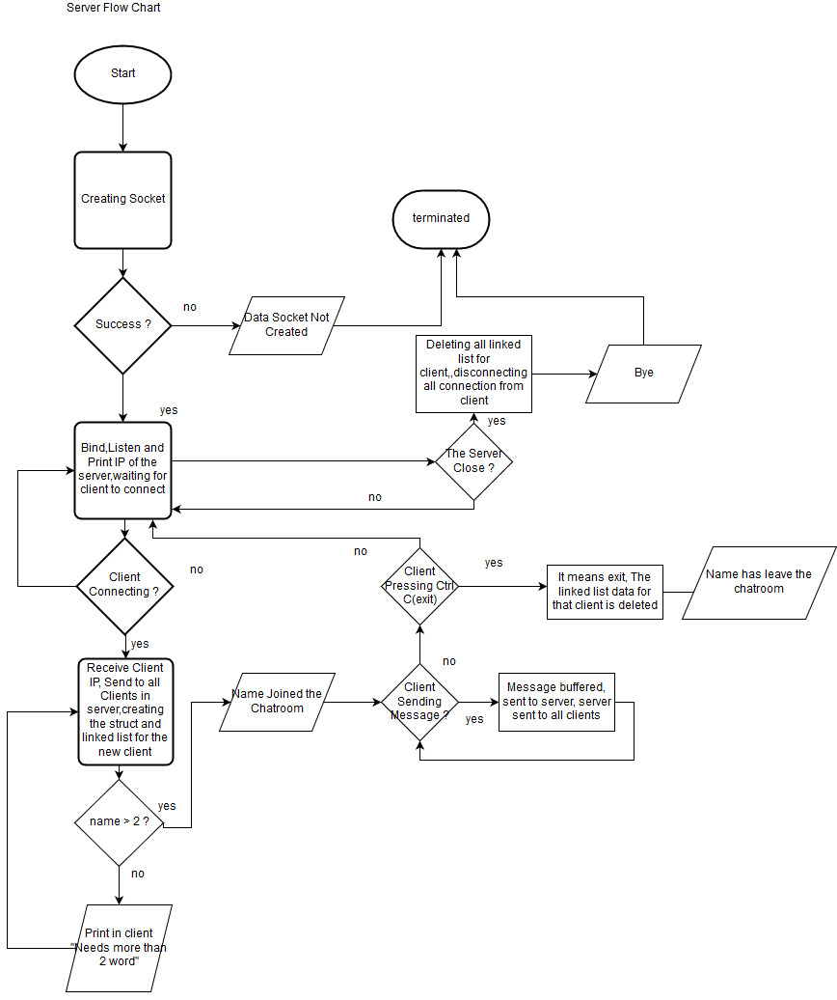
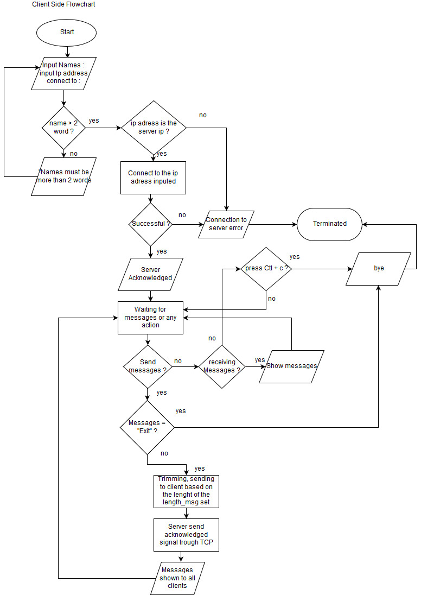

# GroupChat
These codes are implementing socket programming using TCP connection. It's important to remember, this code only working on computers with Linux/MacOS based operating system and will not work on Windows since Windows has different API with Linux and MacOS.

FLOWCHART
======

PROGRAM TUTORIALS
======
Requirements
--------

To make this program, you will need:
  - Linux/MacOS     (the authors use Ubuntu 16.04)
  - Code Editor     (the authors use Geany)
  - WiFi connection (if you want to use more than one computers)
  - Some libraries  (you will not need to install/download these library since it has already exist)
  
      o) signal.h
      
      o) unistd.h
      
      o) sys/types.h
      
      o) sys/socket.h
      
      o) netinet/in.h
      
      o) arpa/inet.h
      
      o) pthread.h
      
Build Client-Server Connection (for connection on different computers)
--------
Since we use TCP connection, we need to connect the computers to the same network (you ) 

Run The Server Code
--------

Run The Client Code
--------
