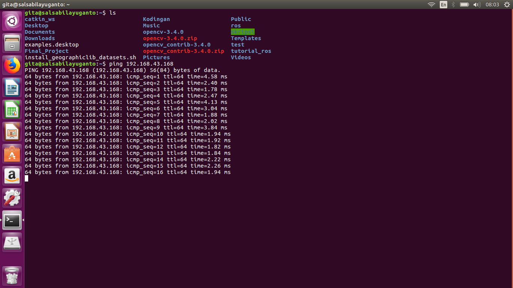
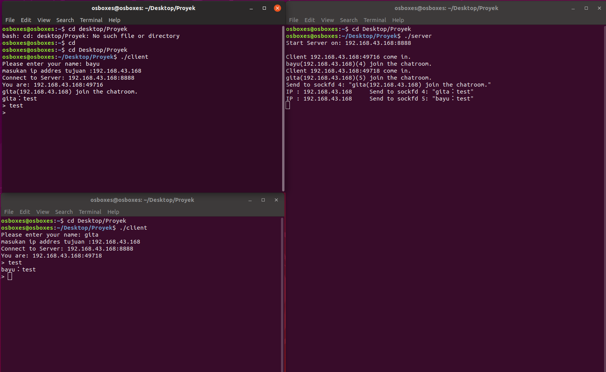
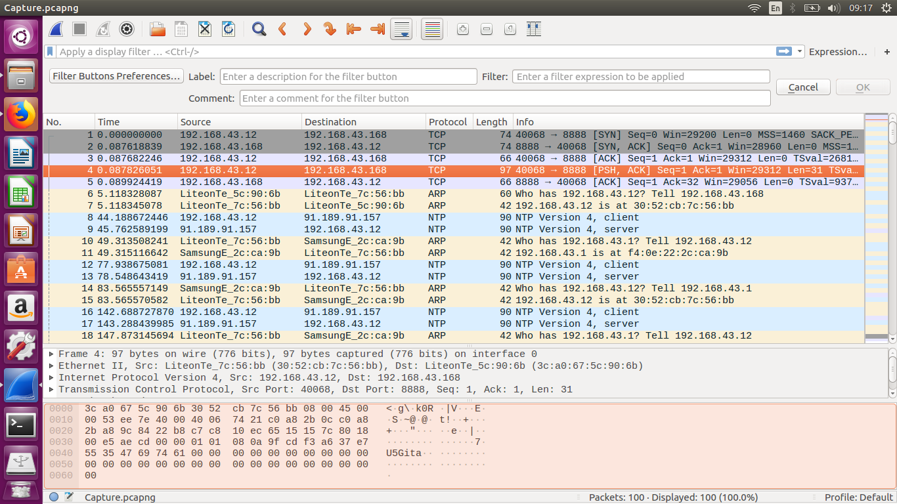

# GroupChat
These codes are implementing socket programming using TCP connection. It's important to remember, this code only working on computers with Linux/MacOS based operating system and will not work on Windows since Windows has different API with Linux and MacOS.

FLOWCHART
======


PROGRAM TUTORIALS
======
Requirements
--------

To make this program, you will need:
  - Linux/MacOS     (the authors use Ubuntu 16.04)
  - Code Editor     (the authors use Geany)
  - WiFi connection (if you want to use more than one computers)
  - Some libraries  (you will not need to install/download these library since it has already exist)
  
      o) signal.h
      
      o) unistd.h
      
      o) sys/types.h
      
      o) sys/socket.h
      
      o) netinet/in.h
      
      o) arpa/inet.h
      
      o) pthread.h
      
Build Client-Server Connection (for connection on different computers)
--------
Since we use TCP connection, we need to connect the computers to the same network (you could using LAN wire or WiFi connection).
Here, we use WiFi connection to build client-server connection, so the computers connected to the same WiFi. Before running the code, you need to make sure the computers are connected by PING the other computer's ip address on linux terminal, using this command:
```
ping (ip.address)
```
if PING succeed, some data will appear on screen like picture below:


this mean your computers have successfully connected and your computer ready to run the codes.


Run The Server Code
--------

1. Compile the Code
```
gcc -pthread -o server server.c
```
2. Run the code

It is important to remember that server code must be ran before the client code, and should be always on during chatting. If this code stop running, connection between clients are ended.
```
./server
```


Run The Client Code
--------
1. Compile the Code
```
gcc -pthread -o client client.c
```
2. Run the code

You can run the client code on the same computer where the server code run but they must be ran on different terminal. You able to run several client codes on same computer.
```
./client
```
When you run this code you have to specify ip address of server used, so if there are several server exist you can choose which server you want to use. You will also have to enter username that you want to use in groupchat. This username will appear on other clients terminal and server terminal.


PROGRAM DOCUMENTATION
======


PROGRAM ANALYSIS
======
To understand and analyze data transfer that happen within the connection, we use Wireshark to capture communication between server-client and client-client (you can see that in file Capture.pcapng and put attention on transaction using TCP protocol). Here is some datas that we've captured:
                                     

From that piece of data, we can see that when client (ip 192.168.43.12) start the connection with the server (ip 192.168.43.168) the client sends signal to the server then the server acknowledging or indicating that the server has recieved the signal and then send the signal back then the client acknowledging it back. After make sure they have succesfully transfer the same signal they ready to transfer more data. As you can see at line 4 the client send data to server, then the server acknowledging the data at line 5.   
